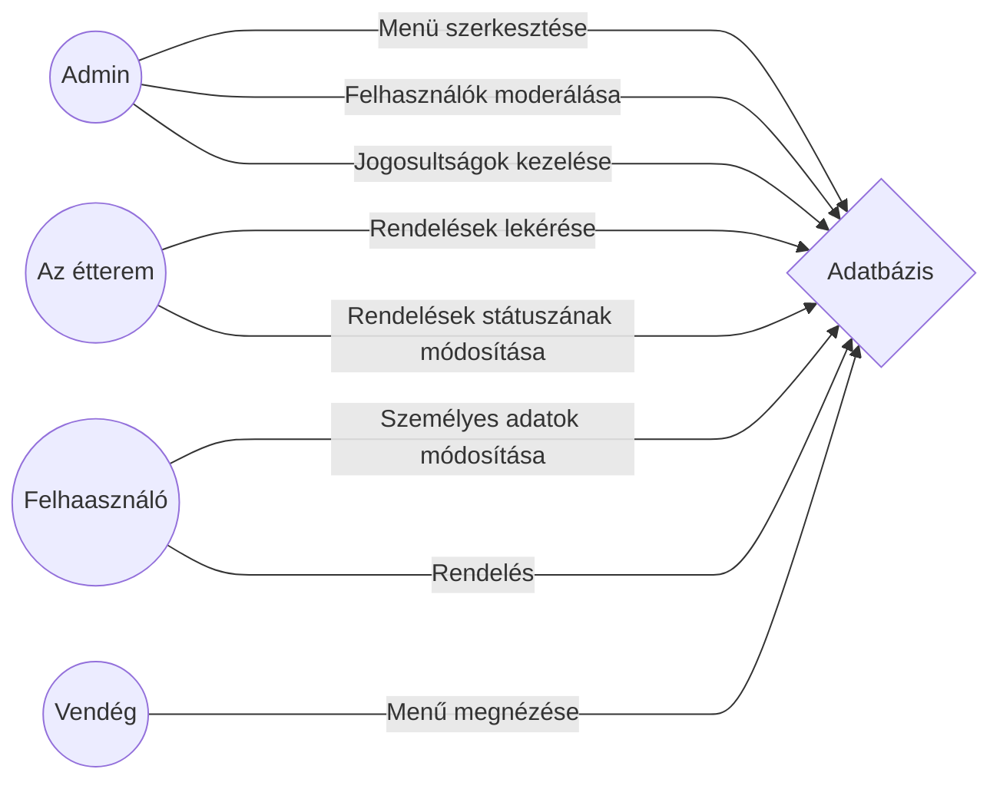

# Funkcionális specifikáció
## A fejlesztés folyamán főbb motivációink, és hátráltató tényezők
Célunk egy olyan felhasználóbarát, ergonomikus weboldal készítése, melynek segítségével az ügyfelek othonuk kényelméből élvezhetik frissen készített pizzákat legyen az egyéni kikapcsolódás keretein belül, családi esemény vagy időtöltés a párjukkal. 
Korlátozott munkaerőforrás és idő --- tekintettel a járványhelyzet mostani alakulására --- áll csak rendelkezésünkre, így bankkártyás fizetési lehetőséget valamint hasonló bonyulult elemeket nem áll módunkban biztonságosan implementálni.
## A rendszer természete
### ***A renszert felhasználók 3 csoportra oszthatók***
* Adminisztrátorok
* Felhasználók
* Vendégek

|								|A felhasznlók jogkörei									|
|-------------------------------|-------------------------------------------------------|
|Az adminisztrátorok			|-- tudjanak a menühöz hozzáadni és törölni is belőle	|
|								|-- tudjanak felhasználókat moderálni					|
|								|-- tudjanak jogosultságokat kezelni					|
|A felhasználók					|-- tudják személyes adataikat módosítani				|
|								|-- tudjanak rendelni									|
|A vendégek						|-- meg tudja nézni a menűt								|
### Rendelések nyomonkövetése
Arendelések nyomonkövetéséhez hozzá kell adnunk még egy negyedik jogkört, ez lesz az étterem saját felhasználói fiókja. Ez nem tartozik bele a felhasznlói csoportokba, ez azok felett fog állni, az adminisztrátorok álltal is érinthetetlen.

### ***Megvalósítandó feladatok:***
-- A fiókokhoz jelszót kell biztosítani
-- A fontosabb funkciókat felhasználói fiókhoz kell kötni
-- Az étterem saját fiókját érinthetetlenné kell tenni, számát azonban nem korlátozhatjuk a későbbi esetleges terjeszkedés miatt
## Funkciók használati esetei
**to be continued**
## Forgató könyvek
Minden felhasználónkat egy igényes és esztétikus kezdőlap fogad amiről felhasználóink tovább mehetnek (a navigációs sávon keresztül) megannyi oldalra. **to be continued**
## A weboldal szükségessége
A kishazánkat is elérő koronavírus 4. hulláma folyamán kiemelt fontosságú, hogy az érintkezések számát ahol lehet csökkentsük, valamint az esetleges újboli lezárásokat követően a kisvállalkozások anyagi bevételeit fenn tudjuk tartani, hogy megannyi ígéretes vállakozás életben tudjon maradni ezen időszak alatt. Manapság egy vállalkozás életében hatalmas mérföldkő, egy a vállalkozáshoz szorosan köthető weboldal megjelenése. Ennek a weboldalnak a célja az emberek széles körű tájékoztatása a vállalkozás álltal nyújtott szolgáltatásokról. Ezen okokból kifolyólag fontos egy weblap mielőbbi készítése.