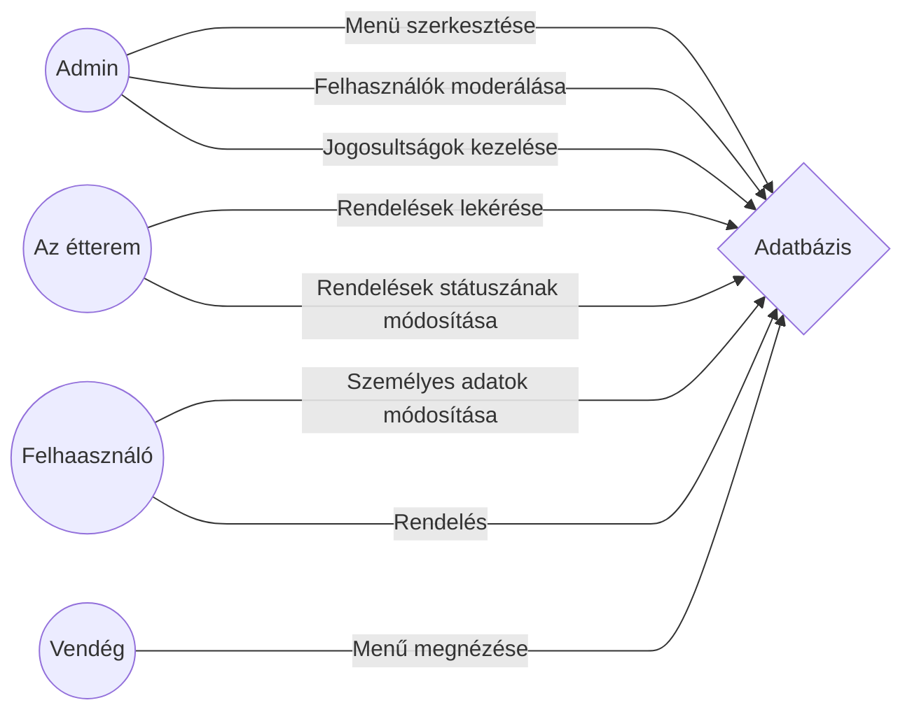

# Funkcionális specifikáció
## A fejlesztés folyamán főbb motivációink, és hátráltató tényezők
Célunk egy olyan felhasználóbarát, ergonomikus weboldal készítése, melynek segítségével az ügyfelek othonuk kényelméből élvezhetik frissen készített pizzákat legyen az egyéni kikapcsolódás keretein belül, családi esemény vagy időtöltés a párjukkal. 
Korlátozott munkaerőforrás és idő --- tekintettel a járványhelyzet mostani alakulására --- áll csak rendelkezésünkre, így bankkártyás fizetési lehetőséget valamint hasonló bonyulult elemeket nem áll módunkban biztonságosan implementálni.
## A rendszer természete
### ***A renszert felhasználók 3 csoportra oszthatók***
* Adminisztrátorok
* Felhasználók
* Vendégek

|								|A felhasznlók jogkörei									|
|-------------------------------|-------------------------------------------------------|
|Az adminisztrátorok			|-- tudjanak a menühöz hozzáadni és törölni is belőle	|
|								|-- tudjanak felhasználókat moderálni					|
|								|-- tudjanak jogosultságokat kezelni					|
|A felhasználók					|-- tudják személyes adataikat módosítani				|
|								|-- tudjanak rendelni									|
|A vendégek						|-- meg tudja nézni a menűt								|
### Rendelések nyomonkövetése
Arendelések nyomonkövetéséhez hozzá kell adnunk még egy negyedik jogkört, ez lesz az étterem saját felhasználói fiókja. Ez nem tartozik bele a felhasznlói csoportokba, ez azok felett fog állni, az adminisztrátorok álltal is érinthetetlen.

### ***Megvalósítandó feladatok:***
-- A fiókokhoz jelszót kell biztosítani
-- A fontosabb funkciókat felhasználói fiókhoz kell kötni
-- Az étterem saját fiókját érinthetetlenné kell tenni, számát azonban nem korlátozhatjuk a későbbi esetleges terjeszkedés miatt
## Funkciók használati esetei
A rendszer használói a következők:

* vendég
* regisztrált
* adminisztrátor

A rendszernek a következő funkciókat kell ellátnia:

* Adminisztrátorok tudjanak terméket regisztrálni és törölni
* A regisztrált és vendég felhasználók tudjanak termékeket összehasonlítani
* A regisztrált és vendég felhasználók tudjanak termékeket rendelni
* A regisztrált és vendég felhasználók tudjanak fizetni
* A regisztrált felhasználók tudjanak fiók adatot módosítani
* A regisztrált felhasználók tudjanak hozzászólásokat írni
* A regisztrált felhasználók tudjanak új jelszót kérni
* A regisztrált felhasználók tudják a kosár tartalmát menteni
* Adminisztrátorok tudjanak felhasználókat moderálni
* Adminisztrátorok tudjanak jogosultságokat kezelni
* Adminisztrátorok tudjanak új terméket hozzáadni
* Adminisztrátorok képesek legyenek a webshopot hibamentesen karbantartani
* vendégek belépés nélkül is tudjanak keresni és rendelni

A rendszerhez tartozik még a vásárlási folyamatban használt kosár funkció is.

Előfeltételek:

* adminisztrátorok és regisztráltak részére a rendszer használatához jelszó szükséges
* fiókadat módosításhoz, hozzászóláshoz, új jelszó kéréshez, és a kosár tartalmának mentéséhez regisztráció szükséges

## Forgató könyvek
Minden felhasználónkat egy igényes és esztétikus kezdőlap fogad amiről felhasználóink tovább mehetnek (a navigációs sávon keresztül) megannyi oldalra.
A navigáció sáv a Kezdőlap, Kategóriák, Kiemelet Ajánlatok és Hírlevélre való feliratkozás menüpontokat tartalmazza. Az oldal logója mellett egy keresővel lehet keresni a termékek között. A headerben szerepel még egy "kosár" funkció, amire kattintva meg lehet tekinteni a megvásárolni kívánt termékeket, illetve, egy felhassználói felületre navigáló ikon. A bejelentkező felületen keresztül lehet regisztrációs folyamatot végrehajtani. Ezen funkciók a rendszerbe való belépés előtt minden esetben elérhetők.

Amennyiben a felhasználó adminisztrátor, a "Kezdőlap" menüpont mellett a "Módosítás" opció jelenik meg. Ezt választva megjelenítjük az adminisztrációs felületet, ahol az oldallal kapcsolatos változtatásokat lehet elvégezni. Termék hozzáadsa, törlés, módosítás, akciózás, ár, felhasználó hozzáadása, törlése, módosítása, jogosuétságának beállítása.

Emellett a felhasználó ikonra kattintva megjelenik a belépett felhasználó neve, személyes adatai, jelszava, "Kijelentkezés" pontok közül lehet választani.

A Személyes adatok űrlapon végrehajtható feladatok:

### ***A Személyes adatok felületen megjelenítendő feladatok:***
	1) Felhasználók esetében módosítható:
* Név
* Telefonszám
* e-mail cím
* lakcím

	2) Egy termék választása esetén:

* Láthatunk egy képet a termékről.
* Mellette a termékről kaphatunk pontosabb információkat:
**  Neve
** Ára
** Vásárlói visszajelzések: Csak bejelentkezett felhasználó tud írni.
** Rövid leírás
* A "Kosárba" gomb mellett megadhatjuk, hogy hány db ilyen terméket szerenénk vásárolni.
* Jelzi, ha elfogyott / limitált mennyiségben van.
* Akció esetén a régi ár is megjelenik.

## A weboldal szükségessége
A kishazánkat is elérő koronavírus 4. hulláma folyamán kiemelt fontosságú, hogy az érintkezések számát ahol lehet csökkentsük, valamint az esetleges újboli lezárásokat követően a kisvállalkozások anyagi bevételeit fenn tudjuk tartani, hogy megannyi ígéretes vállakozás életben tudjon maradni ezen időszak alatt. Manapság egy vállalkozás életében hatalmas mérföldkő, egy a vállalkozáshoz szorosan köthető weboldal megjelenése. Ennek a weboldalnak a célja az emberek széles körű tájékoztatása a vállalkozás álltal nyújtott szolgáltatásokról. Ezen okokból kifolyólag fontos egy weblap mielőbbi készítése.